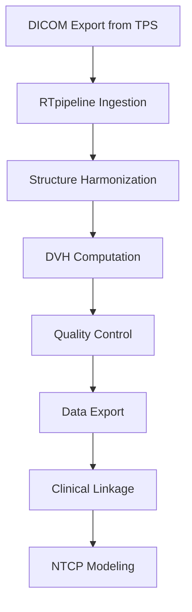
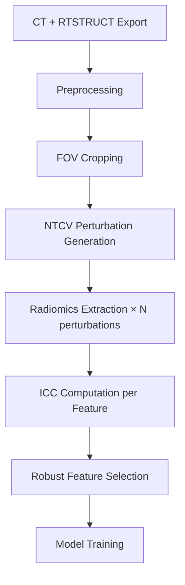
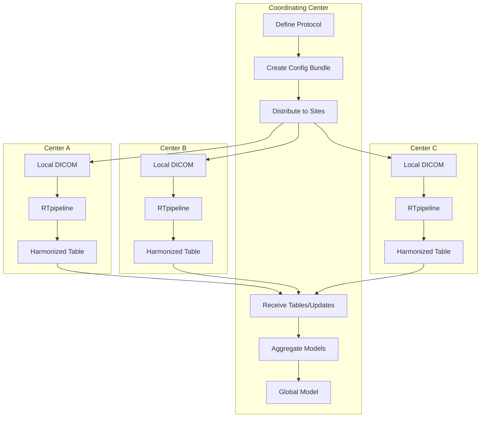

# Case Studies

**Real-world applications of RTpipeline in radiotherapy research**

This section presents three detailed case studies demonstrating how RTpipeline addresses common challenges in radiotherapy data science. Each case study includes scientific background, step-by-step workflow, example code, and expected outcomes.

---

## Overview

| Case Study | Domain | Key Features Used |
|------------|--------|-------------------|
| [NTCP Modeling](#case-study-1-ntcp-modeling-for-late-rectal-toxicity) | Dosimetric modeling | DVH extraction, structure harmonization |
| [Radiomics Signature](#case-study-2-radiomics-signature-for-treatment-response) | Imaging biomarkers | NTCV perturbations, robustness analysis |
| [Multi-Center Harmonization](#case-study-3-multi-center-data-harmonization) | Federated AI | Structure mapping, standardized ETL |

---

## Case Study 1: NTCP Modeling for Late Rectal Toxicity

*From Clinical DVHs to Robust NTCP Models: Single-Center Prostate RT with RTpipeline*

### Summary

This case study demonstrates how RTpipeline can be used to construct a normal tissue complication probability (NTCP) model for late rectal toxicity in a single-center retrospective prostate radiotherapy cohort. Starting from raw DICOM RTSTRUCT/RTPLAN/RTDOSE exports, RTpipeline standardizes structure nomenclature, computes a comprehensive set of dose-volume histogram (DVH) metrics for the rectum and bladder, and outputs an analysis-ready table that can be directly linked with clinical toxicity scores.

### Scientific Background

Late rectal toxicity remains a clinically relevant adverse effect of definitive prostate radiotherapy, despite advances in planning and image guidance. Several dose-response relationships have been proposed (e.g., Quantitative Analyses of Normal Tissue Effects in the Clinic [QUANTEC] recommendations), but many are derived from relatively small cohorts or heterogeneous methodologies for DVH derivation and endpoint definition.

**Research Question:** *Given a contemporary single-center cohort, what is the relationship between 3D planned rectal dose distributions and the risk of grade ≥2 late rectal toxicity, when DVH metrics are computed through a standardized, reproducible pipeline?*

### RTpipeline Workflow



#### Step 1: Data Ingestion

Collect DICOM CT, RTSTRUCT, RTPLAN, and RTDOSE for all eligible prostate RT patients. Organize per-patient/per-course export directories.

#### Step 2: Structure Harmonization

Define a structure mapping where local variations are mapped to canonical labels:

```yaml
# config.yaml - structure_mapping section
structure_mapping:
  RECTUM:
    patterns: ["Rectum", "RECT", "Rectum_full", "rectum*"]
  BLADDER:
    patterns: ["Bladder", "BLAD", "bladder*", "Vessie"]
  PTV_PROSTATE:
    patterns: ["PTV*prostate*", "PTV_7*", "PTV_SIB"]
```

#### Step 3: DVH Computation

Configure DVH metrics of interest:

```yaml
dvh:
  metrics:
    - Dmean
    - Dmax
    - D2cc
    - V40Gy
    - V60Gy
    - V70Gy
    - V75Gy
  structures:
    - RECTUM
    - BLADDER
    - PTV_PROSTATE
```

#### Step 4: Quality Control

RTpipeline generates QC reports summarizing:

- Missing structures
- Extreme values (e.g., `Rectum_V70Gy > 90%`)
- Dose grid characteristics
- Frame-of-reference consistency

#### Step 5: Data Export and Clinical Linkage

Export produces a per-plan table with patient ID, plan ID, DVH metrics, and RT metadata.

### Example Code

**Running RTpipeline:**

```bash
# Run pipeline on DICOM exports
docker run --rm -v /data:/data kstawiski/rtpipeline:latest \
  snakemake --cores 8 --configfile configs/prostate_ntcp.yaml
```

**NTCP Modeling in Python:**

```python
import pandas as pd
from sklearn.model_selection import StratifiedKFold, cross_val_score
from sklearn.preprocessing import StandardScaler
from sklearn.linear_model import LogisticRegression
from sklearn.pipeline import Pipeline

# Load RTpipeline DVH output
dvh = pd.read_excel("_RESULTS/dvh_metrics.xlsx")

# Load clinical toxicity data
toxicity = pd.read_csv("clinical/toxicity.csv")
toxicity["late_rectal_tox_g2plus"] = (toxicity["grade"] >= 2).astype(int)

# Filter for rectum and merge
rectum = dvh[dvh['structure_name'] == 'RECTUM']
data = rectum.merge(
    toxicity[["patient_id", "late_rectal_tox_g2plus"]],
    on="patient_id"
)

# Define features
feature_cols = ["V40Gy", "V60Gy", "V70Gy", "Dmean_Gy", "Dmax_Gy"]
X = data[feature_cols]
y = data["late_rectal_tox_g2plus"]

# L2-regularized logistic regression
pipe = Pipeline([
    ("scaler", StandardScaler()),
    ("logreg", LogisticRegression(max_iter=500, solver="liblinear"))
])

cv = StratifiedKFold(n_splits=5, shuffle=True, random_state=42)
auc_scores = cross_val_score(pipe, X, y, cv=cv, scoring="roc_auc")
print(f"Cross-validated AUC: {auc_scores.mean():.3f} ± {auc_scores.std():.3f}")
```

**Time-to-Event Analysis with Cox Regression:**

```python
from lifelines import CoxPHFitter

cox_df = data[feature_cols + ["followup_months", "late_rectal_tox_g2plus"]]

cph = CoxPHFitter()
cph.fit(
    cox_df,
    duration_col="followup_months",
    event_col="late_rectal_tox_g2plus"
)
cph.print_summary()
```

### Expected Outcomes

1. **Reproducible DVH metrics** computed with identical interpolation and volume definitions
2. **Transparent preprocessing** fully documented in version-controlled configs
3. **Publication-ready data** with clear provenance for Methods sections
4. **Shareable protocols** enabling external validation at collaborating centers

### Relevant Documentation

- [Output Format Reference](../user_guide/output_format.md)
- [DVH Metrics Guide](../user_guide/results_interpretation.md)
- [Structure Mapping](../getting_started/index.md)

---

## Case Study 2: Radiomics Signature for Treatment Response

*Robust CT Radiomics for Response Prediction: IBSI-Aligned Feature Extraction with NTCV Perturbations*

### Summary

This case study demonstrates the use of RTpipeline for developing a radiomics signature to predict treatment response in thoracic radiotherapy. RTpipeline handles CT preprocessing, systematic field-of-view cropping around the target volume, IBSI-aligned radiomics feature extraction, and built-in robustness assessment using NTCV perturbation chains. The result is a robust feature set that has been stress-tested against realistic imaging and contour variations.

### Scientific Background

Radiomics aims to quantify intratumoural heterogeneity and microenvironmental characteristics by extracting quantitative features from medical images. Numerous studies report associations between radiomic signatures and treatment response, but reproducibility is often limited by:

- Inconsistent preprocessing
- Non-standardized feature definitions
- Unassessed feature robustness

**Research Question:** *Can we identify a robust CT-based radiomics signature that predicts treatment response in lung cancer when features are extracted and stress-tested within a standardized, IBSI-informed framework?*

### The Robustness Problem

Without robustness assessment, radiomics models may rely on features that are:

- Sensitive to small variations in image noise
- Unstable under minor contour perturbations
- Non-reproducible across different scanners

RTpipeline addresses this through **NTCV perturbation chains** (Noise, Translation, Contour, Volume) following Zwanenburg et al. (2019).

### RTpipeline Workflow



#### Step 1: Preprocessing Configuration

```yaml
# Systematic preprocessing aligned with IBSI
preprocessing:
  resampling:
    spacing_mm: [1.0, 1.0, 3.0]
    interpolator: "sitkBSpline"
  intensity:
    normalize: true
    window_hu: [-1000, 400]
```

#### Step 2: CT Cropping

```yaml
ct_cropping:
  enabled: true
  region: "thorax"
  superior_margin_cm: 2.0
  inferior_margin_cm: 2.0
```

#### Step 3: NTCV Perturbation Configuration

```yaml
radiomics_robustness:
  enabled: true
  segmentation_perturbation:
    apply_to_structures: ["GTV*", "PTV*"]
    intensity: "standard"  # 15-30 perturbations

    # Volume perturbations (V)
    small_volume_changes: [-0.15, -0.10, 0.0, 0.10, 0.15]

    # Translation perturbations (T)
    max_translation_mm: 3.0

    # Contour randomization (C)
    n_random_contour_realizations: 2

    # Image noise (N)
    noise_levels: [0.0, 10.0, 20.0]  # HU std dev
```

#### Step 4: Robustness Thresholds

```yaml
thresholds:
  icc:
    robust: 0.90      # Conservative: ICC ≥ 0.90
    acceptable: 0.75  # Standard: ICC ≥ 0.75
  cov:
    robust_pct: 10.0     # CoV ≤ 10%
    acceptable_pct: 20.0 # CoV ≤ 20%
```

### Example Code

**Running Radiomics with Robustness Assessment:**

```bash
snakemake --cores 8 radiomics_robustness_ct
```

**Feature Selection Based on Robustness:**

```python
import pandas as pd

# Load radiomics features and robustness metrics
features = pd.read_excel("_RESULTS/radiomics_ct.xlsx")
robustness = pd.read_excel(
    "_RESULTS/radiomics_robustness_summary.xlsx",
    sheet_name="robust_features"
)

# Get robust feature names (ICC ≥ 0.90, CoV ≤ 10%)
robust_feature_names = robustness["feature_name"].tolist()

# Filter to robust features only
X_robust = features[features.columns.intersection(robust_feature_names)]

print(f"Total features extracted: {len(features.columns)}")
print(f"Robust features retained: {len(X_robust.columns)}")
print(f"Retention rate: {100*len(X_robust.columns)/len(features.columns):.1f}%")
```

**Building a Sparse Radiomics Signature:**

```python
from sklearn.linear_model import LogisticRegression
from sklearn.preprocessing import StandardScaler
from sklearn.model_selection import cross_val_score, StratifiedKFold
from sklearn.pipeline import Pipeline

# Load clinical response labels
clinical = pd.read_csv("clinical/response.csv")
data = features.merge(clinical[["patient_id", "response"]], on="patient_id")

X = data[robust_feature_names]
y = data["response"]

# LASSO-regularized logistic regression for sparse signature
pipe = Pipeline([
    ("scaler", StandardScaler()),
    ("clf", LogisticRegression(
        penalty="l1",
        solver="saga",
        max_iter=2000,
        C=0.1
    ))
])

cv = StratifiedKFold(n_splits=5, shuffle=True, random_state=42)
auc = cross_val_score(pipe, X, y, cv=cv, scoring="roc_auc")
print(f"Robust features AUC: {auc.mean():.3f} ± {auc.std():.3f}")

# Identify selected features
pipe.fit(X, y)
coefs = pd.Series(pipe.named_steps["clf"].coef_[0], index=X.columns)
selected = coefs[coefs.abs() > 0.01].sort_values(key=abs, ascending=False)
print(f"\nSelected signature features:\n{selected}")
```

### Visualizing Feature Robustness

```python
import matplotlib.pyplot as plt

robustness_all = pd.read_excel(
    "_RESULTS/radiomics_robustness_summary.xlsx",
    sheet_name="global_summary"
)

fig, axes = plt.subplots(1, 2, figsize=(12, 4))

# ICC distribution
axes[0].hist(robustness_all["icc"], bins=30, edgecolor='black')
axes[0].axvline(0.90, color='green', linestyle='--', label='Robust (0.90)')
axes[0].axvline(0.75, color='orange', linestyle='--', label='Acceptable (0.75)')
axes[0].set_xlabel("ICC")
axes[0].set_ylabel("Number of Features")
axes[0].set_title("Feature Robustness Distribution")
axes[0].legend()

# ICC vs CoV scatter
axes[1].scatter(robustness_all["icc"], robustness_all["cov_pct"], alpha=0.5)
axes[1].axvline(0.90, color='green', linestyle='--')
axes[1].axhline(10, color='green', linestyle='--')
axes[1].set_xlabel("ICC")
axes[1].set_ylabel("CoV (%)")
axes[1].set_title("Robustness Quadrant Plot")

plt.tight_layout()
plt.savefig("robustness_analysis.png", dpi=150)
```

### Expected Outcomes

1. **Curated feature set** with quantified robustness under realistic perturbations
2. **Transparent IBSI-aligned methodology** suitable for peer review
3. **Sparse, interpretable signature** for treatment response prediction
4. **Reproducible analysis** with version-controlled configurations

### Relevant Documentation

- [Radiomics Robustness Module](../features/radiomics_robustness.md)
- [CT Cropping](../features/ct_cropping.md)
- [Output Format](../user_guide/output_format.md)

---

## Case Study 3: Multi-Center Data Harmonization

*Harmonized Multi-Center RT Data for Federated AI: RTpipeline as a Local ETL Engine*

### Summary

This case study illustrates how RTpipeline can serve as a harmonized, locally deployed ETL engine in a federated learning setting involving multiple radiotherapy centers. Each center independently runs RTpipeline on its own data using a shared configuration bundle specifying canonical structure names, CT cropping rules, and feature definitions. Centers keep raw DICOM data on-site while only sharing harmonized feature tables or model updates with a central coordinating node.

### Scientific Background

High-performance AI models in radiotherapy often require large, diverse datasets that exceed the scale of any single institution. However, regulatory, legal, and ethical constraints frequently preclude raw image or DICOM data sharing.

**Federated Learning** has emerged as a promising paradigm where models are trained across multiple sites without centralizing data. For federated models to be scientifically meaningful, the input representations must be harmonized across centers.

**Research Question:** *Can RTpipeline serve as a standardized ETL layer at each center, ensuring that each site contributes features and labels that are comparable and compatible for federated AI model training?*

### The Harmonization Challenge

```
┌─────────────────────────────────────────────────────────────────────┐
│                    Without RTpipeline                               │
├─────────────────────────────────────────────────────────────────────┤
│  Center A: "Rectum", V70Gy, 2mm dose grid, Eclipse exports          │
│  Center B: "RECT_full", V70%, 3mm dose grid, RayStation exports     │
│  Center C: "rectum_prv", V70Gy_rel, 2.5mm grid, Monaco exports      │
│                                                                     │
│  Result: Incompatible features, unreliable multi-site models        │
└─────────────────────────────────────────────────────────────────────┘

┌─────────────────────────────────────────────────────────────────────┐
│                    With RTpipeline                                  │
├─────────────────────────────────────────────────────────────────────┤
│  All Centers: "RECTUM", V70Gy, standardized interpolation           │
│  Shared config: prostate_multicenter_v1.yaml                        │
│  Same code: RTpipeline v2.0                                         │
│                                                                     │
│  Result: Harmonized features, reliable cross-site validation        │
└─────────────────────────────────────────────────────────────────────┘
```

### RTpipeline Workflow



#### Step 1: Consortium-Wide Protocol Definition

```yaml
# prostate_multicenter_v1.yaml
# Shared configuration for all participating centers

version: "1.0"
consortium: "ProstateFederated2025"

# Canonical structure definitions
structure_mapping:
  RECTUM:
    patterns: ["Rectum*", "RECT*", "rectum*", "Rektum*"]
    required: true
  BLADDER:
    patterns: ["Bladder*", "BLAD*", "bladder*", "Vessie*"]
    required: true
  PTV:
    patterns: ["PTV*", "ptv*"]
    required: true

# Standardized DVH computation
dvh:
  interpolation: "linear"
  dose_units: "Gy"
  volume_units: "cc"
  metrics:
    - Dmean
    - Dmax
    - D2cc
    - V50Gy
    - V60Gy
    - V70Gy

# CT preprocessing for radiomics (if used)
ct_cropping:
  enabled: true
  region: "pelvis"

# Radiomics configuration (IBSI-aligned)
radiomics:
  binWidth: 25  # Fixed bin width in HU
  resampling_mm: [1.0, 1.0, 3.0]
```

#### Step 2: Local Environment Setup

Each center installs the same RTpipeline version:

```bash
# Using Docker (recommended for consistency)
docker pull kstawiski/rtpipeline:v2.0

# Or local installation with pinned dependencies
conda env create -f rtpipeline-v2.0.yml
```

#### Step 3: Local Data Processing

Each center runs RTpipeline locally:

```bash
# At Center A
docker run --rm \
  -v /center_a/dicom:/data/input:ro \
  -v /center_a/output:/data/output:rw \
  -v /shared/prostate_multicenter_v1.yaml:/config.yaml:ro \
  kstawiski/rtpipeline:v2.0 \
  snakemake --cores 8 --configfile /config.yaml
```

#### Step 4: Federated Data Interface

```python
# Example: Local federated client (pseudo-code)
import pandas as pd
import torch
from torch.utils.data import TensorDataset, DataLoader

# Load harmonized features produced by RTpipeline
features = pd.read_excel("/center_a/output/_RESULTS/dvh_metrics.xlsx")
labels = pd.read_csv("/center_a/clinical/outcomes.csv")

data = features.merge(labels, on="patient_id", how="inner")

# Standard feature columns (same across all centers due to shared config)
feature_cols = [
    "RECTUM_Dmean_Gy", "RECTUM_V50Gy", "RECTUM_V60Gy", "RECTUM_V70Gy",
    "BLADDER_Dmean_Gy", "BLADDER_V50Gy", "BLADDER_V60Gy", "BLADDER_V70Gy"
]

X = torch.tensor(data[feature_cols].values, dtype=torch.float32)
y = torch.tensor(data["toxicity_grade2plus"].values, dtype=torch.float32)

# Local training (wrapped in federated framework)
dataset = TensorDataset(X, y)
loader = DataLoader(dataset, batch_size=32, shuffle=True)

def train_local_model(model, optimizer, criterion, epochs=5):
    model.train()
    for _ in range(epochs):
        for xb, yb in loader:
            optimizer.zero_grad()
            pred = model(xb).squeeze()
            loss = criterion(pred, yb)
            loss.backward()
            optimizer.step()
    return model.state_dict()  # Send to central aggregator
```

#### Step 5: Central Aggregation

```python
# At coordinating center: FedAvg aggregation
def federated_average(state_dicts):
    """Average model weights from all centers."""
    averaged = {}
    n_centers = len(state_dicts)
    for key in state_dicts[0].keys():
        averaged[key] = sum(sd[key] for sd in state_dicts) / n_centers
    return averaged

# Receive state_dicts from each center
center_weights = [...]  # Collected from centers A, B, C
global_model_weights = federated_average(center_weights)
```

### Ensuring Reproducibility Across Sites

**Version Control Checklist:**

| Item | Location | Purpose |
|------|----------|---------|
| RTpipeline version | Docker tag or `conda env export` | Exact software |
| Config file | Git repository with DOI | Processing parameters |
| Structure mapping | Within config YAML | Nomenclature harmonization |
| Random seeds | Config + code | Deterministic results |

**QC Verification:**

```python
# Each center can verify their outputs match expected schema
def verify_harmonization(df, expected_columns):
    """Check that RTpipeline output matches consortium schema."""
    missing = set(expected_columns) - set(df.columns)
    if missing:
        raise ValueError(f"Missing columns: {missing}")

    # Check for expected structure names
    structures = df['structure_name'].unique()
    canonical = {'RECTUM', 'BLADDER', 'PTV'}
    if not canonical.issubset(set(structures)):
        raise ValueError(f"Missing canonical structures")

    return True

# Run at each center before sharing data
verify_harmonization(dvh_df, expected_columns)
```

### Expected Outcomes

1. **Semantic consistency** - Same variable names and definitions across all sites
2. **Computational reproducibility** - Identical DVH/radiomics computation
3. **Data governance compliance** - Raw data never leaves the institution
4. **Scalable model development** - Easy to add new centers with shared config

### Impact on Multi-Center Research

- **Lower barrier** for international collaboration
- **Auditable preprocessing** published as supplementary material
- **Improved generalization** of AI models trained on harmonized data
- **Regulatory readiness** with clear data provenance

### Relevant Documentation

- [Docker Setup Guide](../getting_started/docker_setup.md)
- [Configuration Reference](../technical/architecture.md)
- [Security Considerations](../technical/security.md)

---

## Adapting Case Studies to Your Research

These case studies provide templates that can be adapted to your specific research context:

### For Different Disease Sites

- **Head & Neck:** Adjust structure mapping for parotids, larynx, constrictors
- **Breast:** Include heart, LAD, lung substructures
- **CNS:** Focus on brainstem, optic structures, hippocampi

### For Different Endpoints

- **Overall Survival:** Use time-to-event models (Cox regression)
- **Local Control:** Binary classification or competing risks
- **Quality of Life:** Ordinal regression or multi-endpoint modeling

### For Different Modalities

- **MR-based Radiomics:** Adjust preprocessing for MR intensity normalization
- **PET Radiomics:** Configure SUV-based feature extraction
- **Multi-parametric:** Combine CT + MR + PET features

---

## Methods Boilerplate

The following text can be adapted for your Methods section:

!!! note "DVH Extraction Methods"
    Dose-volume histogram metrics were extracted using RTpipeline (version X.X) [cite]. Structure sets were harmonized to canonical nomenclature via a mapping dictionary. DVH curves were computed using [interpolation method] with a dose resolution of [X Gy]. The following metrics were derived: mean dose (D~mean~), maximum dose (D~max~), dose to 2cc (D~2cc~), and volume receiving ≥[X] Gy (V~XGy~).

!!! note "Radiomics Extraction Methods"
    Radiomic features were extracted using RTpipeline (version X.X) [cite] with PyRadiomics [cite] following Image Biomarker Standardisation Initiative (IBSI) recommendations [cite]. Images were resampled to [X×X×X mm] voxels using [interpolation method]. Feature stability was assessed using NTCV perturbation chains (Zwanenburg et al., 2019) [cite], comprising [N] perturbations per ROI including Gaussian noise injection (σ = 0, 10, 20 HU), rigid translations (±3 mm), contour randomization, and volume adaptation (±15%). Features with ICC ≥ 0.90 and coefficient of variation ≤ 10% were classified as robust and retained for modeling.

---

## References

1. Zwanenburg A, et al. (2019). Assessing robustness of radiomic features by image perturbation. *Scientific Reports* 9:614. [DOI: 10.1038/s41598-018-36758-2](https://doi.org/10.1038/s41598-018-36758-2)

2. Zwanenburg A, et al. (2020). The Image Biomarker Standardization Initiative. *Radiology* 295(2):328-338. [DOI: 10.1148/radiol.2020191145](https://doi.org/10.1148/radiol.2020191145)

3. Koo TK, Li MY. (2016). A guideline of selecting and reporting ICC for reliability research. *J Chiropr Med* 15(2):155-163. [DOI: 10.1016/j.jcm.2016.02.012](https://doi.org/10.1016/j.jcm.2016.02.012)

4. Bentzen SM, et al. (2010). QUANTEC: Organ-specific papers. *Int J Radiat Oncol Biol Phys* 76(3):S1-S160.
