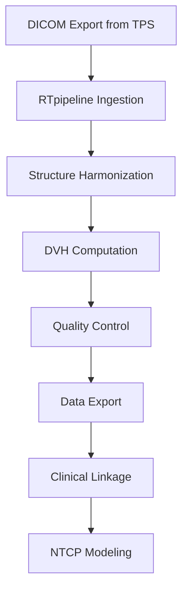
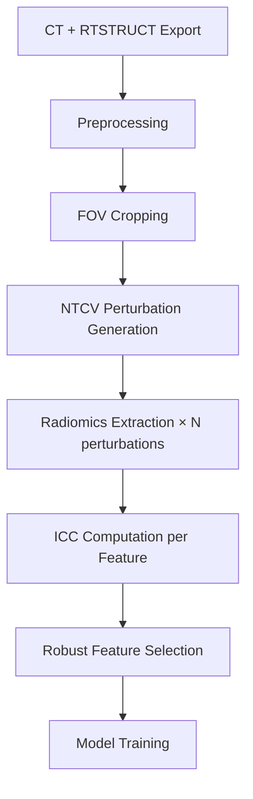
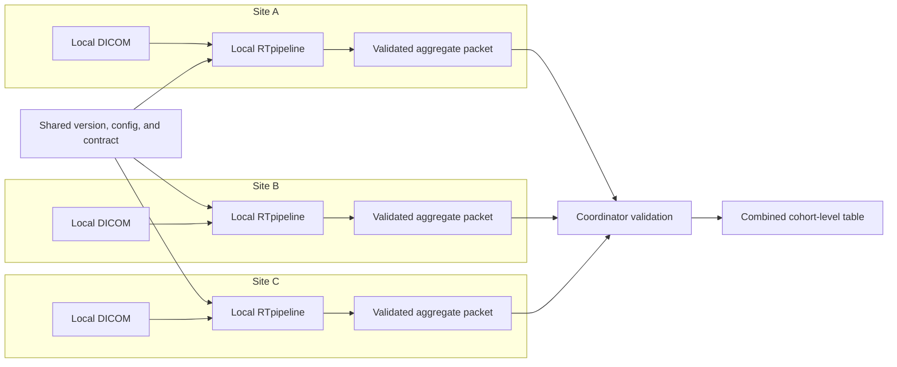

# Case Studies

**Real-world applications of RTpipeline in radiotherapy research**

This section presents three detailed case studies demonstrating how RTpipeline addresses common challenges in radiotherapy data science. Each case study includes scientific background, step-by-step workflow, example code, and expected outcomes.

---

## Overview

| Case Study | Domain | Key Features Used |
|------------|--------|-------------------|
| [NTCP Modeling](#case-study-1-ntcp-modeling-for-late-rectal-toxicity) | Dosimetric modeling | DVH extraction, structure harmonization |
| [Radiomics Signature](#case-study-2-radiomics-signature-for-treatment-response) | Imaging biomarkers | NTCV perturbations, robustness analysis |
| [Distributed Reliability](#case-study-3-distributed-radiomics-reliability-analysis) | Aggregate radiomics validation | Standardized local ETL, hash-bound packets |

---

## Case Study 1: NTCP Modeling for Late Rectal Toxicity

*From Clinical DVHs to Robust NTCP Models: Single-Center Prostate RT with RTpipeline*

### Summary

This case study demonstrates how RTpipeline can be used to construct a normal tissue complication probability (NTCP) model for late rectal toxicity in a single-center retrospective prostate radiotherapy cohort. Starting from raw DICOM RTSTRUCT/RTPLAN/RTDOSE exports, RTpipeline standardizes structure nomenclature, computes a comprehensive set of dose-volume histogram (DVH) metrics for the rectum and bladder, and outputs an analysis-ready table that can be directly linked with clinical toxicity scores.

### Scientific Background

Late rectal toxicity remains a clinically relevant adverse effect of definitive prostate radiotherapy, despite advances in planning and image guidance. Several dose-response relationships have been proposed (e.g., Quantitative Analyses of Normal Tissue Effects in the Clinic [QUANTEC] recommendations), but many are derived from relatively small cohorts or heterogeneous methodologies for DVH derivation and endpoint definition.

**Research Question:** *Given a contemporary single-center cohort, what is the relationship between 3D planned rectal dose distributions and the risk of grade ≥2 late rectal toxicity, when DVH metrics are computed through a standardized, reproducible pipeline?*

### RTpipeline Workflow


```mermaid
graph TD
    A[DICOM Export from TPS] --> B[RTpipeline Ingestion]
    B --> C[Structure Harmonization]
    C --> D[DVH Computation]
    D --> E[Quality Control]
    E --> F[Data Export]
    F --> G[Clinical Linkage]
    G --> H[NTCP Modeling]
```

#### Step 1: Data Ingestion

Collect DICOM CT, RTSTRUCT, RTPLAN, and RTDOSE for all eligible prostate RT patients. Organize per-patient/per-course export directories.

#### Step 2: Structure Harmonization

Define a structure mapping where local variations are mapped to canonical labels:

```yaml
# config.yaml - structure_mapping section
structure_mapping:
  RECTUM:
    patterns: ["Rectum", "RECT", "Rectum_full", "rectum*"]
  BLADDER:
    patterns: ["Bladder", "BLAD", "bladder*", "Vessie"]
  PTV_PROSTATE:
    patterns: ["PTV*prostate*", "PTV_7*", "PTV_SIB"]
```

#### Step 3: DVH Computation

Configure DVH metrics of interest:

```yaml
dvh:
  metrics:
    - Dmean
    - Dmax
    - D2cc
    - V40Gy
    - V60Gy
    - V70Gy
    - V75Gy
  structures:
    - RECTUM
    - BLADDER
    - PTV_PROSTATE
```

#### Step 4: Quality Control

RTpipeline generates QC reports summarizing:

- Missing structures
- Extreme values (e.g., `Rectum_V70Gy > 90%`)
- Dose grid characteristics
- Frame-of-reference consistency

#### Step 5: Data Export and Clinical Linkage

Export produces a per-plan table with patient ID, plan ID, DVH metrics, and RT metadata.

### Example Code

**Running RTpipeline:**

```bash
# Run pipeline on DICOM exports
docker run --rm -v /data:/data kstawiski/rtpipeline:latest \
  snakemake --cores 8 --configfile configs/prostate_ntcp.yaml
```

**NTCP Modeling in Python:**

```python
import pandas as pd
from sklearn.model_selection import StratifiedKFold, cross_val_score
from sklearn.preprocessing import StandardScaler
from sklearn.linear_model import LogisticRegression
from sklearn.pipeline import Pipeline

# Load RTpipeline DVH output
dvh = pd.read_excel("_RESULTS/dvh_metrics.xlsx")

# Load clinical toxicity data
toxicity = pd.read_csv("clinical/toxicity.csv")
toxicity["late_rectal_tox_g2plus"] = (toxicity["grade"] >= 2).astype(int)

# Filter for rectum and merge
rectum = dvh[dvh['structure_name'] == 'RECTUM']
data = rectum.merge(
    toxicity[["patient_id", "late_rectal_tox_g2plus"]],
    on="patient_id"
)

# Define features
feature_cols = ["V40Gy", "V60Gy", "V70Gy", "Dmean_Gy", "Dmax_Gy"]
X = data[feature_cols]
y = data["late_rectal_tox_g2plus"]

# L2-regularized logistic regression
pipe = Pipeline([
    ("scaler", StandardScaler()),
    ("logreg", LogisticRegression(max_iter=500, solver="liblinear"))
])

cv = StratifiedKFold(n_splits=5, shuffle=True, random_state=42)
auc_scores = cross_val_score(pipe, X, y, cv=cv, scoring="roc_auc")
print(f"Cross-validated AUC: {auc_scores.mean():.3f} ± {auc_scores.std():.3f}")
```

**Time-to-Event Analysis with Cox Regression:**

```python
from lifelines import CoxPHFitter

cox_df = data[feature_cols + ["followup_months", "late_rectal_tox_g2plus"]]

cph = CoxPHFitter()
cph.fit(
    cox_df,
    duration_col="followup_months",
    event_col="late_rectal_tox_g2plus"
)
cph.print_summary()
```

### Expected Outcomes

1. **Reproducible DVH metrics** computed with identical interpolation and volume definitions
2. **Transparent preprocessing** fully documented in version-controlled configs
3. **Publication-ready data** with clear provenance for Methods sections
4. **Shareable protocols** enabling external validation at collaborating centers

### Relevant Documentation

- [Output Format Reference](../user_guide/output_format.md)
- [DVH Metrics Guide](../user_guide/results_interpretation.md)
- [Structure Mapping](../getting_started/index.md)

---

## Case Study 2: Radiomics Signature for Treatment Response

*Robust CT Radiomics for Response Prediction: IBSI-Aligned Feature Extraction with NTCV Perturbations*

### Summary

This case study demonstrates the use of RTpipeline for developing a radiomics signature to predict treatment response in thoracic radiotherapy. RTpipeline handles CT preprocessing, systematic field-of-view cropping around the target volume, IBSI-aligned radiomics feature extraction, and built-in robustness assessment using NTCV perturbation chains. The result is a robust feature set that has been stress-tested against realistic imaging and contour variations.

### Scientific Background

Radiomics aims to quantify intratumoural heterogeneity and microenvironmental characteristics by extracting quantitative features from medical images. Numerous studies report associations between radiomic signatures and treatment response, but reproducibility is often limited by:

- Inconsistent preprocessing
- Non-standardized feature definitions
- Unassessed feature robustness

**Research Question:** *Can we identify a robust CT-based radiomics signature that predicts treatment response in lung cancer when features are extracted and stress-tested within a standardized, IBSI-informed framework?*

### The Robustness Problem

Without robustness assessment, radiomics models may rely on features that are:

- Sensitive to small variations in image noise
- Unstable under minor contour perturbations
- Non-reproducible across different scanners

RTpipeline addresses this through **NTCV perturbation chains** (Noise, Translation, Contour, Volume) following Zwanenburg et al. (2019).

### RTpipeline Workflow


```mermaid
graph TD
    A[CT + RTSTRUCT Export] --> B[Preprocessing]
    B --> C[FOV Cropping]
    C --> D[NTCV Perturbation Generation]
    D --> E[Radiomics Extraction × N perturbations]
    E --> F[ICC Computation per Feature]
    F --> G[Robust Feature Selection]
    G --> H[Model Training]
```

#### Step 1: Preprocessing Configuration

```yaml
# Systematic preprocessing aligned with IBSI
preprocessing:
  resampling:
    spacing_mm: [1.0, 1.0, 3.0]
    interpolator: "sitkBSpline"
  intensity:
    normalize: true
    window_hu: [-1000, 400]
```

#### Step 2: CT Cropping

```yaml
ct_cropping:
  enabled: true
  region: "thorax"
  superior_margin_cm: 2.0
  inferior_margin_cm: 2.0
```

#### Step 3: NTCV Perturbation Configuration

```yaml
radiomics_robustness:
  enabled: true
  segmentation_perturbation:
    apply_to_structures: ["GTV*", "PTV*"]
    intensity: "standard"  # 15-30 perturbations

    # Volume perturbations (V)
    small_volume_changes: [-0.15, -0.10, 0.0, 0.10, 0.15]

    # Translation perturbations (T)
    max_translation_mm: 3.0

    # Contour randomization (C)
    n_random_contour_realizations: 2

    # Image noise (N)
    noise_levels: [0.0, 10.0, 20.0]  # HU std dev
```

#### Step 4: Robustness Thresholds

```yaml
thresholds:
  icc:
    robust: 0.90      # Conservative: ICC ≥ 0.90
    acceptable: 0.75  # Standard: ICC ≥ 0.75
  cov:
    robust_pct: 10.0     # CoV ≤ 10%
    acceptable_pct: 20.0 # CoV ≤ 20%
```

### Example Code

**Running Radiomics with Robustness Assessment:**

```bash
snakemake --cores 8 radiomics_robustness_ct
```

**Feature Selection Based on Robustness:**

```python
import pandas as pd

# Load radiomics features and robustness metrics
features = pd.read_excel("_RESULTS/radiomics_ct.xlsx")
robustness = pd.read_excel(
    "_RESULTS/radiomics_robustness_summary.xlsx",
    sheet_name="robust_features"
)

# Get robust feature names (ICC ≥ 0.90, CoV ≤ 10%)
robust_feature_names = robustness["feature_name"].tolist()

# Filter to robust features only
X_robust = features[features.columns.intersection(robust_feature_names)]

print(f"Total features extracted: {len(features.columns)}")
print(f"Robust features retained: {len(X_robust.columns)}")
print(f"Retention rate: {100*len(X_robust.columns)/len(features.columns):.1f}%")
```

**Building a Sparse Radiomics Signature:**

```python
from sklearn.linear_model import LogisticRegression
from sklearn.preprocessing import StandardScaler
from sklearn.model_selection import cross_val_score, StratifiedKFold
from sklearn.pipeline import Pipeline

# Load clinical response labels
clinical = pd.read_csv("clinical/response.csv")
data = features.merge(clinical[["patient_id", "response"]], on="patient_id")

X = data[robust_feature_names]
y = data["response"]

# LASSO-regularized logistic regression for sparse signature
pipe = Pipeline([
    ("scaler", StandardScaler()),
    ("clf", LogisticRegression(
        penalty="l1",
        solver="saga",
        max_iter=2000,
        C=0.1
    ))
])

cv = StratifiedKFold(n_splits=5, shuffle=True, random_state=42)
auc = cross_val_score(pipe, X, y, cv=cv, scoring="roc_auc")
print(f"Robust features AUC: {auc.mean():.3f} ± {auc.std():.3f}")

# Identify selected features
pipe.fit(X, y)
coefs = pd.Series(pipe.named_steps["clf"].coef_[0], index=X.columns)
selected = coefs[coefs.abs() > 0.01].sort_values(key=abs, ascending=False)
print(f"\nSelected signature features:\n{selected}")
```

### Visualizing Feature Robustness

```python
import matplotlib.pyplot as plt

robustness_all = pd.read_excel(
    "_RESULTS/radiomics_robustness_summary.xlsx",
    sheet_name="global_summary"
)

fig, axes = plt.subplots(1, 2, figsize=(12, 4))

# ICC distribution
axes[0].hist(robustness_all["icc"], bins=30, edgecolor='black')
axes[0].axvline(0.90, color='green', linestyle='--', label='Robust (0.90)')
axes[0].axvline(0.75, color='orange', linestyle='--', label='Acceptable (0.75)')
axes[0].set_xlabel("ICC")
axes[0].set_ylabel("Number of Features")
axes[0].set_title("Feature Robustness Distribution")
axes[0].legend()

# ICC vs CoV scatter
axes[1].scatter(robustness_all["icc"], robustness_all["cov_pct"], alpha=0.5)
axes[1].axvline(0.90, color='green', linestyle='--')
axes[1].axhline(10, color='green', linestyle='--')
axes[1].set_xlabel("ICC")
axes[1].set_ylabel("CoV (%)")
axes[1].set_title("Robustness Quadrant Plot")

plt.tight_layout()
plt.savefig("robustness_analysis.png", dpi=150)
```

### Expected Outcomes

1. **Curated feature set** with quantified robustness under realistic perturbations
2. **Transparent IBSI-aligned methodology** suitable for peer review
3. **Sparse, interpretable signature** for treatment response prediction
4. **Reproducible analysis** with version-controlled configurations

### Relevant Documentation

- [Radiomics Robustness Module](../features/radiomics_robustness.md)
- [CT Cropping](../features/ct_cropping.md)
- [Output Format](../user_guide/output_format.md)

---

## Case Study 3: Distributed Radiomics Reliability Analysis

*One local method, one aggregate contract, multiple independently processed cohorts*

### Summary

Each participating site can run RTpipeline behind its own institutional boundary
using a shared software version and analysis configuration. For radiomics
reliability studies, a site exports only a hash-bound cohort-level summary
packet. A coordinator validates every packet against the same contract and
combines accepted aggregate rows.

This is distributed aggregate analysis. RTpipeline does not currently train or
aggregate models across sites, provide secure aggregation, or implement
differential privacy. A packet may still require institutional approval before
transfer.

### Workflow


```mermaid
flowchart LR
    C[Shared version, config, and contract] --> A1
    C --> A2
    C --> A3
    subgraph Site A
      D1[Local DICOM] --> A1[Local RTpipeline] --> P1[Validated aggregate packet]
    end
    subgraph Site B
      D2[Local DICOM] --> A2[Local RTpipeline] --> P2[Validated aggregate packet]
    end
    subgraph Site C
      D3[Local DICOM] --> A3[Local RTpipeline] --> P3[Validated aggregate packet]
    end
    P1 --> V[Coordinator validation]
    P2 --> V
    P3 --> V
    V --> R[Combined cohort-level table]
```

Raw DICOM and patient-level radiomic values are not fields in this packet
contract. Literal cohort names are replaced by coded node labels, but those
labels and cohort signatures are not an anonymity mechanism.

### Step 1: Freeze the shared contract

```bash
CONTRACT_ID=consortium-ntcv-icc-v1
MINIMUM_SUBJECTS=5

rtpipeline federation contract \
  --contract-id "$CONTRACT_ID" \
  --minimum-subjects "$MINIMUM_SUBJECTS" \
  > contract.json

CONTRACT_SHA256=$(jq -r .contract_sha256 contract.json)
```

The digest covers the schema, semantic rules, permitted packet files, audit
rules, and minimum cell size. All sites and the coordinator retain the same
three values: contract ID, digest, and minimum-subject threshold.

### Step 2: Process locally

Every site uses the same released RTpipeline version and reviewed configuration
for DICOM organization, contours, radiomics preprocessing, perturbation chains,
and cohort-level reliability summaries. Site-specific acquisition and anatomy
can still affect the measurements; identical code does not make cohorts
exchangeable.

### Step 3: Export one aggregate packet per site

```bash
rtpipeline federation export \
  --input cohort_icc.parquet \
  --output packet-node-a13f \
  --node-id node-a13f \
  --contract-id "$CONTRACT_ID" \
  --contract-sha256 "$CONTRACT_SHA256" \
  --minimum-subjects "$MINIMUM_SUBJECTS"
```

The packet contains only `manifest.json` and deterministic `metrics.csv.gz`.
Export fails if the table has an extra column, duplicate feature identity,
invalid ICC interval, small cell, nonfinite value, path, URI, date, DICOM UID,
hostname-like value, or direct identifier-like token.

### Step 4: Validate and combine centrally

```bash
rtpipeline federation aggregate \
  --packet packet-node-a13f \
  --packet packet-node-b72c \
  --packet packet-node-c94d \
  --output aggregate \
  --contract-id "$CONTRACT_ID" \
  --contract-sha256 "$CONTRACT_SHA256" \
  --minimum-subjects "$MINIMUM_SUBJECTS"
```

The coordinator supplies its own contract values. It rejects a node that lowers
the threshold, changes the schema, forges summary metadata, adds a file or
symlink, or declares an audit result that cannot be reproduced. The aggregate
manifest binds both files from every accepted packet by SHA-256.

### What this design establishes

1. **Method identity:** sites can run the same released code and configuration.
2. **Interface conformance:** accepted packets have one exact row and metadata
   contract.
3. **Data minimization:** the implemented packet schema has no raw DICOM,
   patient/course ID, patient-level feature, local path, date, or outcome field.
4. **Auditable aggregation:** coordinator outputs retain packet hashes and node
   denominators.

It does not by itself establish cross-site biological transportability,
clinical utility, site anonymity, legal permission to transfer aggregates, or
federated learning performance. Those are separate scientific and governance
questions.

### Relevant documentation

- [Distributed aggregate analysis](../features/distributed_analysis.md)
- [Radiomics robustness](../features/radiomics_robustness.md)
- [Security considerations](../technical/security.md)

---

## Adapting Case Studies to Your Research

These case studies provide templates that can be adapted to your specific research context:

### For Different Disease Sites

- **Head & Neck:** Adjust structure mapping for parotids, larynx, constrictors
- **Breast:** Include heart, LAD, lung substructures
- **CNS:** Focus on brainstem, optic structures, hippocampi

### For Different Endpoints

- **Overall Survival:** Use time-to-event models (Cox regression)
- **Local Control:** Binary classification or competing risks
- **Quality of Life:** Ordinal regression or multi-endpoint modeling

### For Different Modalities

- **MR-based Radiomics:** Adjust preprocessing for MR intensity normalization
- **PET Radiomics:** Configure SUV-based feature extraction
- **Multi-parametric:** Combine CT + MR + PET features

---

## Methods Boilerplate

The following text can be adapted for your Methods section:

!!! note "DVH Extraction Methods"
    Dose-volume histogram metrics were extracted using RTpipeline (version 2.2.0) [cite]. Structure sets were harmonized to canonical nomenclature via a mapping dictionary. DVH curves were computed using [interpolation method] with a dose resolution of [X Gy]. The following metrics were derived: mean dose (D~mean~), maximum dose (D~max~), dose to 2cc (D~2cc~), and volume receiving ≥[X] Gy (V~XGy~).

!!! note "Radiomics Extraction Methods"
    Radiomic features were extracted using RTpipeline (version 2.2.0) [cite] with PyRadiomics 3.0.1 [cite] following Image Biomarker Standardisation Initiative (IBSI) recommendations [cite]. Images were resampled to [X×X×X mm] voxels using [interpolation method]. Feature stability was assessed using NTCV perturbation chains (Zwanenburg et al., 2019) [cite], comprising [N] perturbations per ROI including Gaussian noise injection (σ = 0, 10, 20 HU), rigid translations (±3 mm), contour randomization, and volume adaptation (±15%). Features with ICC ≥ 0.90 and coefficient of variation ≤ 10% were classified as robust and retained for modeling.

---

## References

1. Zwanenburg A, et al. (2019). Assessing robustness of radiomic features by image perturbation. *Scientific Reports* 9:614. [DOI: 10.1038/s41598-018-36938-4](https://doi.org/10.1038/s41598-018-36938-4)

2. Zwanenburg A, et al. (2020). The Image Biomarker Standardization Initiative. *Radiology* 295(2):328-338. [DOI: 10.1148/radiol.2020191145](https://doi.org/10.1148/radiol.2020191145)

3. Koo TK, Li MY. (2016). A guideline of selecting and reporting ICC for reliability research. *J Chiropr Med* 15(2):155-163. [DOI: 10.1016/j.jcm.2016.02.012](https://doi.org/10.1016/j.jcm.2016.02.012)

4. Bentzen SM, et al. (2010). QUANTEC: Organ-specific papers. *Int J Radiat Oncol Biol Phys* 76(3):S1-S160.
