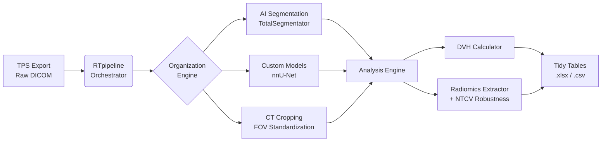

# RTpipeline

**The Big Data Radiotherapy Pipeline**

*From raw clinical exports to research-ready datasets in one command.*

[](https://kstawiski.github.io/rtpipeline/)
[](https://hub.docker.com/r/kstawiski/rtpipeline)
[](https://github.com/kstawiski/rtpipeline/blob/main/LICENSE)

---

## Introduction

Radiation oncology is undergoing a rapid transformation driven by the increasing availability of large-scale, routinely collected clinical and imaging data. Modern radiotherapy departments generate comprehensive digital records for each treated patient, including planning computed tomography (CT) scans, delineated target volumes and organs at risk (OARs), three-dimensional dose distributions, and detailed treatment plans stored in standardized Digital Imaging and Communications in Medicine (DICOM) objects. Together with electronic health records and cancer registries, these data sources constitute a rich substrate for developing normal tissue complication probability (NTCP) models, radiomics-based biomarkers, and data-driven clinical decision support systems.

**However, the realization of this potential hinges critically on the ability to transform heterogeneous, clinically oriented data into reproducible, analysis-ready research datasets.**

### The Technical Gap

Despite substantial efforts in standardization, several technical barriers impede large-scale radiotherapy data analysis:

| Challenge | Impact |
|-----------|--------|
| **Vendor heterogeneity** | DICOM RT objects exhibit non-trivial variability across TPS vendors (Eclipse, RayStation, Monaco), software versions, and local conventions |
| **Structure naming chaos** | Identical anatomical regions named `Heart`, `heart`, `hrt`, `Coeur` across patients and institutions |
| **Bespoke scripts** | Individual researchers re-implement DICOM parsing for each project, creating fragile, undocumented code |
| **Scale limitations** | Manual QC and structure mapping become infeasible beyond a few hundred patients |
| **Reproducibility collapse** | Each student maintains their own version of preprocessing scripts |

### RTpipeline: An ETL Framework for Radiotherapy

Within health informatics, the **Extract-Transform-Load (ETL)** paradigm has emerged as a foundational concept for managing complex data flows. RTpipeline is a dedicated, research-grade ETL framework specifically tailored for radiotherapy DICOM data.

```
┌─────────────────┐     ┌──────────────────────────────────┐     ┌─────────────────┐
│     EXTRACT     │     │           TRANSFORM              │     │      LOAD       │
│                 │     │                                  │     │                 │
│  • DICOM CT     │     │  • Structure harmonization       │     │  • DVH tables   │
│  • RTSTRUCT     │ ──► │  • TotalSegmentator              │ ──► │  • Radiomics    │
│  • RTDOSE       │     │  • Systematic cropping           │     │  • Metadata     │
│  • RTPLAN       │     │  • Robustness analysis           │     │  • QC reports   │
│                 │     │                                  │     │                 │
└─────────────────┘     └──────────────────────────────────┘     └─────────────────┘
```

---

## Key Capabilities

### 1. Automated Data Engineering

**Problem:** Clinical TPS exports produce messy, unstructured DICOM files with scattered series, inconsistent naming, and locked binary data.

**Solution:** RTpipeline's **Organization Engine** automatically:

- Groups thousands of DICOM files into patient courses (e.g., `Patient123/Course_2023-01`)
- Links Plans, Doses, and Images even across different folders using DICOM UIDs
- Reconciles frame-of-reference mismatches and dose grid transformations

### 2. Standardized Anatomy via AI Segmentation

**Problem:** Physicians only contour clinically relevant structures. A toxicity study on splenic dose requires manual re-contouring of hundreds of patients.

**Solution:** RTpipeline integrates **TotalSegmentator** to automatically generate ~100 standardized anatomical structures for every patient:

| Structure Category | Examples |
|-------------------|----------|
| Cardiovascular | `heart`, `aorta`, `pulmonary_artery` |
| Respiratory | `lung_left`, `lung_right`, `trachea` |
| Gastrointestinal | `esophagus`, `stomach`, `small_bowel`, `colon` |
| Genitourinary | `kidney_left`, `kidney_right`, `urinary_bladder` |
| Musculoskeletal | All vertebrae, ribs, pelvis, femurs |

**Research Impact:** Every patient now has a `heart` contour named exactly `heart`, regardless of what the physician drew.

### 3. Systematic Field-of-View Standardization

**Problem:** Percentage metrics like $V_{20\%}$ are meaningless when total body volume denominators differ due to variable scan lengths.

**Solution:** **Systematic CT Cropping** uses anatomical landmarks (vertebrae, femoral heads) to crop every CT to consistent physical boundaries:

```
Before cropping:
  Patient A (long scan): V20Gy = 500cc / 18,000cc = 2.8%
  Patient B (short scan): V20Gy = 500cc / 15,000cc = 3.3%

After cropping to L1 → Femoral heads:
  Patient A: V20Gy = 500cc / 12,000cc = 4.2%
  Patient B: V20Gy = 500cc / 11,500cc = 4.3%
```

This makes cohort-level comparison statistically defensible.

### 4. Robustness-Aware Radiomics

**Problem:** Radiomics features can be unstable under minor variations in image noise, contour delineation, or scanner settings—leading to non-reproducible signatures.

**Solution:** RTpipeline implements **NTCV perturbation chains** (Zwanenburg et al., 2019):

- **N**oise: Gaussian noise injection simulating scanner variability
- **T**ranslation: Rigid geometric shifts simulating positioning uncertainty
- **C**ontour: Boundary randomization simulating inter-observer variability
- **V**olume: Erosion/dilation simulating segmentation uncertainty

Features are classified by robustness:

| ICC Threshold | Classification | Recommendation |
|--------------|----------------|----------------|
| ICC ≥ 0.90 | **Robust** | Use for predictive modeling |
| 0.75 ≤ ICC < 0.90 | **Acceptable** | Use with caution |
| ICC < 0.75 | **Poor** | Exclude from analysis |

### 5. Analysis-Ready Outputs

Forget parsing DICOM tags. RTpipeline produces tidy, standardized data tables:

```
_RESULTS/
├── dvh_metrics.xlsx      # Dmean, D95%, V20Gy for every structure
├── radiomics_ct.xlsx     # 1000+ IBSI-compliant features
├── case_metadata.xlsx    # Clinical tags, scanner info, kernels
└── qc_reports.xlsx       # Quality control flags and warnings
```

---

## Quick Start

### Option 1: Interactive Docker Setup (Recommended)

```bash
curl -sSL https://raw.githubusercontent.com/kstawiski/rtpipeline/main/setup_docker_project.sh | bash
```

Follow the wizard to generate your `docker-compose.yml` and start the Web UI.

### Option 2: Manual Docker Start

```bash
# Create project structure
mkdir -p Input Output Logs

# Start pipeline
docker-compose up -d

# Open Web UI at http://localhost:8080
```

### Option 3: Google Colab

Try RTpipeline in the cloud with free GPU access:

- [Part 1: GPU Segmentation](https://github.com/kstawiski/rtpipeline/blob/main/rtpipeline_colab_part1_gpu.ipynb)
- [Part 2: CPU Analysis](https://github.com/kstawiski/rtpipeline/blob/main/rtpipeline_colab_part2_cpu.ipynb)

---

## Who Is RTpipeline For?

### PhD Students & Postdocs

*"Spend your PhD on science, not on reinventing DICOM parsing."*

- Accelerate from data collection to analysis in days, not months
- Focus thesis time on methods and hypotheses, not infrastructure
- Built-in tools for methodological rigor (ICC, perturbations, IBSI compliance)

[**PhD Quick Start Guide →**](getting_started/index.md)

### Clinical Researchers

*"A bridge between your TPS and your statistician."*

- Minimal coding required—use prepared configs and the Web UI
- Turn routine clinical plans into analyzable datasets
- Excel/CSV outputs with clinically meaningful variable names

[**Web UI Guide →**](getting_started/webui.md)

### Multi-Center Consortia

*"Same code and settings at every center."*

- Shared configuration files ensure methodological consistency
- Federated analysis—raw data never needs to leave the institution
- Publish config bundles as supplementary materials with DOI

[**Multi-Center Case Study →**](case_studies/index.md#case-study-3-multi-center-data-harmonization)

---

## Data Flow Architecture



---

## Case Studies

Learn how RTpipeline is used in real research scenarios:

| Case Study | Description |
|------------|-------------|
| [NTCP Modeling](case_studies/index.md#case-study-1-ntcp-modeling-for-late-rectal-toxicity) | Build rectal toxicity models from DVH metrics |
| [Radiomics Signatures](case_studies/index.md#case-study-2-radiomics-signature-for-treatment-response) | Develop robust imaging biomarkers with NTCV |
| [Multi-Center AI](case_studies/index.md#case-study-3-multi-center-data-harmonization) | Federated learning with harmonized data |

---

## Technical Innovations

### NTCV Perturbation Chains

Implements the validated methodology from Zwanenburg et al. (2019) for radiomics feature robustness assessment. [Learn more →](features/radiomics_robustness.md)

### Systematic CT Cropping

Anatomical landmark-based cropping for standardized FOV across cohorts. [Learn more →](features/ct_cropping.md)

### Dual Environment Architecture

Resolves NumPy 1.x vs 2.x incompatibility between PyRadiomics and TotalSegmentator via isolated conda environments. [Learn more →](technical/architecture.md)

### Custom nnU-Net Models

Plug-and-play support for institution-specific segmentation models. [Learn more →](features/custom_models.md)

---

## Documentation Sections

<div class="grid cards" markdown>

-   **Getting Started**

    ---

    From zero to your first analyzed patient

    [:octicons-arrow-right-24: Introduction](getting_started/index.md)

-   **User Guide**

    ---

    Output formats, interpretation, troubleshooting

    [:octicons-arrow-right-24: Output Reference](user_guide/output_format.md)

-   **Features**

    ---

    CT cropping, radiomics robustness, custom models

    [:octicons-arrow-right-24: Feature Docs](features/ct_cropping.md)

-   **Technical**

    ---

    Architecture, parallelization, security

    [:octicons-arrow-right-24: Technical Docs](technical/architecture.md)

-   **Case Studies**

    ---

    Real-world research applications

    [:octicons-arrow-right-24: Case Studies](case_studies/index.md)

</div>

---

## Citation

If you use RTpipeline for research, please cite the repository and the underlying tools:

```bibtex
@software{rtpipeline,
  title = {RTpipeline: Automated Radiotherapy DICOM Processing Pipeline},
  author = {Stawiski, Konrad},
  url = {https://github.com/kstawiski/rtpipeline},
  year = {2025}
}
```

Additionally, please cite:

- **TotalSegmentator:** Wasserthal et al., *Radiology: Artificial Intelligence* (2023)
- **PyRadiomics:** van Griethuysen et al., *Cancer Research* (2017)
- **IBSI:** Zwanenburg et al., *Radiology* (2020)

---

## License

This project is licensed under the MIT License. See [LICENSE](https://github.com/kstawiski/rtpipeline/blob/main/LICENSE) for details.
