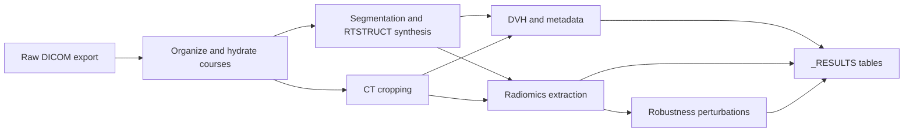

# RTpipeline v2.1.0 Architecture

RTpipeline is a radiotherapy ETL pipeline that turns raw DICOM exports into research-ready tables, derived RTSTRUCTs, QC artifacts, and robustness summaries. In `v2.1.0`, the architecture centers on three design choices:

- **Course-first orchestration:** organize DICOM into patient/course units, then run every downstream stage on those units.
- **Dual-environment execution:** keep TotalSegmentator and the rest of the pipeline on a modern NumPy 2.x stack while routing PyRadiomics and robustness analysis through a compatible NumPy 1.26 environment.
- **Robustness as a first-class stage:** radiomics stability screening is integrated into the main workflow, not bolted on afterward.

## High-Level Flow



## Core Runtime Components

| Layer | Primary modules | What it does | Main outputs |
|-------|-----------------|--------------|--------------|
| Organization | `rtpipeline.cli`, `rtpipeline.organize` | Groups scattered DICOM into coherent patient/course folders and hydrates existing manifests | Course directories under `output_dir/{patient}/{course}` |
| Segmentation | `rtpipeline.segmentation`, `rtpipeline.auto_rtstruct`, `rtpipeline.custom_models` | Runs TotalSegmentator and optional custom nnU-Net models, then emits standardized RTSTRUCTs | `RS_auto.dcm`, custom-model RTSTRUCTs, segmentation NIfTIs |
| CT standardization | `rtpipeline.anatomical_cropping` | Applies anatomy-aware FOV normalization when enabled | Cropped CT/RTSTRUCT variants |
| Dose/QC/metadata | `rtpipeline.dvh`, `rtpipeline.quality_control`, `rtpipeline.metadata` | Computes DVH metrics, QC reports, and case-level metadata | `dvh_metrics.xlsx`, `qc_reports.xlsx`, `case_metadata.xlsx` |
| Radiomics | `rtpipeline.radiomics`, `rtpipeline.radiomics_conda`, `rtpipeline.radiomics_parallel` | Extracts IBSI-oriented CT/MR radiomics with process isolation and thread caps | `radiomics_ct.xlsx`, `radiomics_mr.xlsx` |
| Robustness | `rtpipeline.radiomics_robustness`, CLI subcommands `radiomics-robustness` and `radiomics-robustness-aggregate` | Runs perturbation-based feature stability analysis and cohort aggregation | Per-course `radiomics_robustness_ct.parquet`, aggregate `radiomics_robustness_summary.xlsx` |

## Dual-Environment Design

`v2.1.0` deliberately separates the pipeline into two conda environments:

| Environment | Defined in | Main purpose | Key packages |
|-------------|------------|--------------|--------------|
| `rtpipeline` | `envs/rtpipeline.yaml` | Organization, segmentation, DVH, QC, orchestration | Python 3.11, NumPy 2.x, TotalSegmentator 2.12.0, PyTorch 2.3 |
| `rtpipeline-radiomics` | `envs/rtpipeline-radiomics.yaml` | Radiomics extraction and robustness statistics | Python 3.10, NumPy 1.26, PyRadiomics 3.0.1, Pingouin, PyArrow |

### Why this exists

TotalSegmentator and the modern imaging toolchain are happiest on newer NumPy and Python versions, while PyRadiomics remains pinned to an older compatibility window. Rather than forcing one compromise environment, RTpipeline detects when radiomics work must be delegated and launches it in `rtpipeline-radiomics`.

### What this means operationally

- **Docker builds both environments ahead of time** in the image, so users do not need to manage them manually.
- **Local/conda runs should preserve both YAMLs** for reproducibility if radiomics or robustness are enabled.
- **Radiomics and robustness inherit their own thread limits** to avoid BLAS/OpenMP oversubscription.

## Robustness Module Architecture

The robustness module is a standard stage in the pipeline rather than a side workflow.

### Perturbation model

RTpipeline implements a configurable **NTCV-style perturbation chain**:

- **N**: Gaussian noise injection
- **T**: rigid translations
- **C**: contour randomization
- **V**: volume adaptation via erosion/dilation

The shipped container profile keeps a conservative default with **volume perturbations enabled** and the other axes disabled unless explicitly configured. For manuscript-grade robustness studies, `noise_levels`, `max_translation_mm`, and `n_random_contour_realizations` should be set in `config.yaml`.

### Outputs

- **Per course:** `radiomics_robustness_ct.parquet`
- **Cohort aggregate:** `_RESULTS/radiomics_robustness_summary.xlsx`
- **Typical aggregate sheets:** `global_summary`, `robust_features`, `acceptable_features`, and source-aware breakdowns when multiple segmentation sources are present

### Failure model

Robustness is designed to be informative without making the entire ETL brittle:

- per-course sentinel files record success/failure
- aggregation skips missing or failed course-level outputs
- thread and worker limits mirror the same defensive scheduling used for radiomics

## Orchestration and Scheduling

RTpipeline can be launched directly through `rtpipeline` CLI commands or via Snakemake.

### CLI surface

- `rtpipeline doctor`: environment and GPU sanity checks
- `rtpipeline validate`: config and environment validation
- `rtpipeline radiomics-robustness`: course-level robustness extraction
- `rtpipeline radiomics-robustness-aggregate`: cohort-level aggregation

### Scheduling model

- **Inter-course parallelism:** adaptive worker pools fan out independent patient/course tasks
- **Segmentation:** typically serialized or lightly parallelized on GPU hosts to avoid memory contention
- **Radiomics/robustness:** process-isolated workloads with explicit thread caps
- **Memory pressure handling:** worker pools can back off automatically instead of hard-failing immediately

## Versioned Artifacts

The architecture described here corresponds to `RTpipeline 2.1.0`, with the version declared in:

- `pyproject.toml`
- `rtpipeline/__init__.py`
- `Dockerfile` image label

If you publish results, cite the exact Docker tag or git commit alongside the configuration file used for the run.

### Adaptive Worker Progress Logging
**Function:** `_log_progress()` (utils.py, lines 306-320)

```
Format: "Label: X/Y (Z%) elapsed Ats ETA Bs"
Updates: Per task completion (if show_progress=True)
Example: "Segmentation: 3/10 (30%) elapsed 12.5s ETA 29.2s"
```

### Memory Pressure Detection
**Pattern Matching:** (utils.py, lines 286-303)
```python
_MEMORY_PATTERNS = (
    "out of memory",
    "cuda out of memory",
    "cublas status alloc failed",
    "std::bad_alloc",
    "cannot allocate memory",
    "failed to allocate",
    "not enough memory",
    "mmap failed",
    "oom",
)
```

---

## 8. KEY CONFIGURATION DEFAULTS

### Absolute Defaults (Hardcoded)
```python
workers:                           min(--cores, CPU count) - 1  (auto)
segmentation_workers:              auto (GPU sequential, CPU inherits workers)  # override via config
segmentation_thread_limit:         None (no limit per worker)
radiomics_thread_limit:           4 (if config specifies)
radiomics max_workers:            _calculate_optimal_workers()
custom_models_workers:            1 (GPU constraint)
totalseg_device:                  "gpu"
totalseg_force_split:             True
totalseg_nr_thr_resamp:           1
totalseg_nr_thr_saving:           1
totalseg_num_proc_pre:            1
totalseg_num_proc_export:         1
```

### Conda Dependencies (GPU-enabled)
**File:** `/home/user/rtpipeline/envs/rtpipeline.yaml`
```yaml
- pytorch=2.3.*
- pytorch-cuda=12.1         # CUDA 12.1 support
- torchvision=0.18.*
- torchaudio=2.3.*
- TotalSegmentator>=2.4.0
```

---

## 9. CURRENT OPTIMIZATION OPPORTUNITIES

### Identified in Codebase
1. **Thread Limit Per Worker**: Can be set but defaults to unlimited
2. **GPU Memory Optimization**: force_split already enabled
3. **Process Pool Caching**: Weights pre-loading enabled
4. **Sequential Fallback**: Available via --sequential-radiomics flag

### Configuration Examples

**Maximum GPU Utilization:**
```bash
rtpipeline \
  --dicom-root data/ \
  --outdir output/ \
  --seg-workers 4 \
  --max-workers 8 \
  --totalseg-device gpu
```

**Memory-Constrained System:**
```bash
rtpipeline \
  --dicom-root data/ \
  --outdir output/ \
  --max-workers 2 \
  --seg-workers 1 \
  --seg-proc-threads 4 \
  --radiomics-proc-threads 2 \
  --sequential-radiomics
```

**CPU-Only Mode:**
```bash
rtpipeline \
  --dicom-root data/ \
  --outdir output/ \
  --totalseg-device cpu \
  --max-workers 8 \
  --seg-workers 2
```

---

## 10. SUMMARY TABLE

| Component | Type | Location | Key Parameters |
|-----------|------|----------|-----------------|
| **Main Orchestrator** | CLI | cli.py | --max-workers, --seg-workers |
| **Inter-course Parallelism** | ThreadPoolExecutor | utils.py:323 | max_workers, min_workers |
| **Radiomics Parallelism** | ProcessPoolExecutor | radiomics_parallel.py:311 | max_workers, thread_limit |
| **GPU Segmentation** | External (TotalSegmentator) | segmentation.py:243 | --totalseg-device |
| **Memory Adaptation** | Dynamic Scaling | utils.py:363-460 | Memory error detection |
| **Thread Management** | Environment Variables | Across modules | OMP_NUM_THREADS, etc. |
| **Configuration** | YAML + CLI | config.yaml, cli.py | All parameters |
| **Container Orchestration** | Docker Compose | docker-compose.yml | GPU/CPU profiles |
| **Logging** | File + Console | Logs/rtpipeline.log | Progress tracking |

---

## File Reference Summary

### Core Pipeline Files
- **config.py** (89 lines) - Configuration dataclass
- **cli.py** (924 lines) - Command-line interface & orchestration
- **utils.py** (466 lines) - Adaptive worker pool implementation
- **segmentation.py** (836 lines) - TotalSegmentator integration
- **radiomics_parallel.py** (590 lines) - Process-based radiomics
- **radiomics.py** (first 150+ lines) - Feature extraction
- **custom_models.py** (100+ lines) - Custom model execution

### Configuration Files
- **config.yaml** - Runtime configuration
- **docker-compose.yml** - Container orchestration
- **envs/rtpipeline.yaml** - Conda environment definition
- **custom_structures_*.yaml** - Structure definitions

---
